# Scale a WebLogic Cluster through WKTUI and explore Verrazzano Consoles

## Introduction

We have deployed the WebLogic **opdemo** application. In this lab, we will access the application and explore grafana console, WebLogic Kubernetes Toolkit UI and WebLogic Remote Console.
    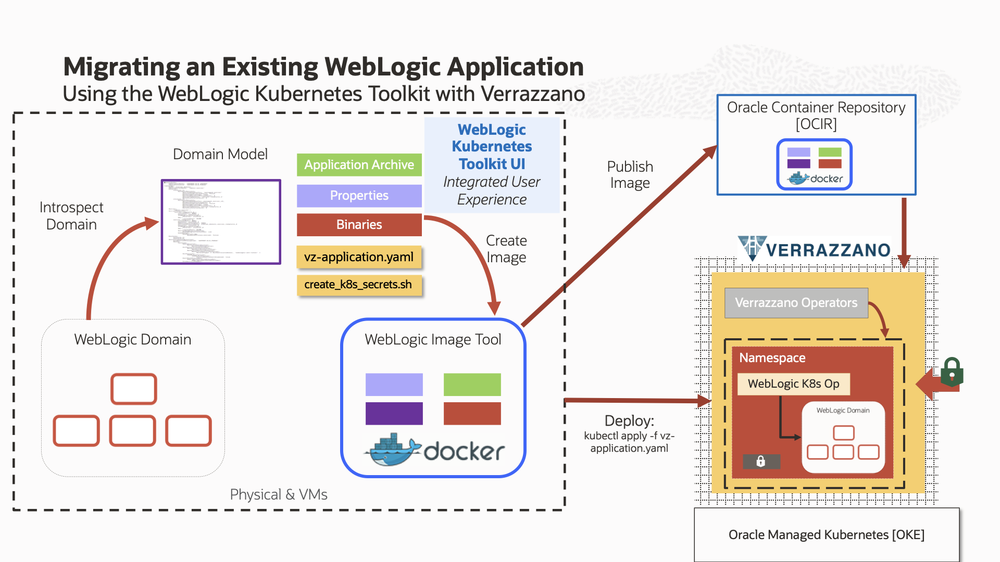

Estimated time: 10 minutes

### Objectives

In this lab, you will:

* Access the WebLogic application deployed to OKE.
* Access the WebLogic Administration Console.

### Prerequisites

* You have access to the remote desktop [WKTUI Demo](http://129.213.16.175/livelabs/vnc.html?resize=scale&quality=9&autoconnect=true&reconnect=true).
* Verrazzano installed on a Oracle Kubernetes Cluster.
* WebLogic **opdemo** application is deployed to Oracle Kubernetes Cluster using WebLogic Kubernetes Toolkit UI.


## Task 1: Open the Remote Desktop for this demo

1. Click [WKTUI Demo](http://129.213.16.175/livelabs/vnc.html?resize=scale&quality=9&autoconnect=true&reconnect=true) to open the Remote Desktop for this Demo.

2. Enter the password, you have received through email.

3. Use this remote desktop for following the further task of this lab.


## Task 2: Access the WebLogic Application and show load balancing

1. Open Chrome browser, Click the first Bookmark **WebLogic App**.
    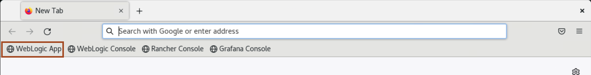

2. Click the refrest button to access the application again, and you will notice request is served by another managed server instance. which reflect load balancing between two managed servers.
    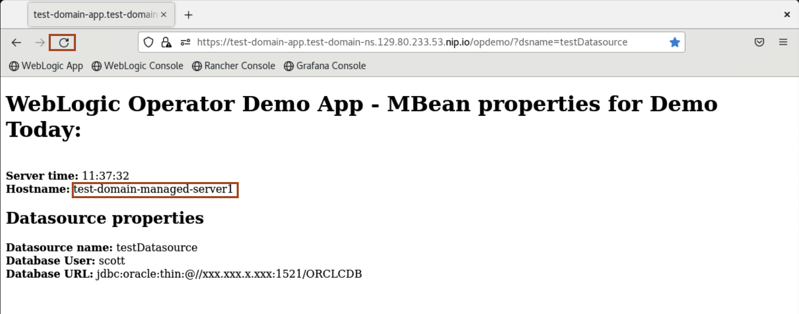
    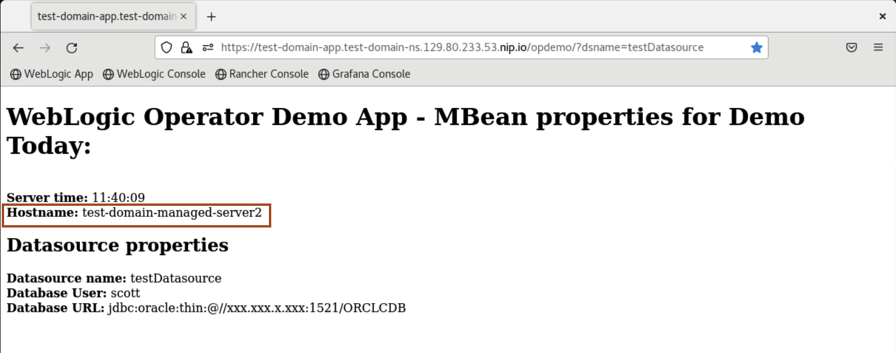

## Task 3: Showcase the WebLogic Console and explore domain resources

1. Open a new tab in Chrome browser and Click the second Bookmark **WebLogic Console**.
    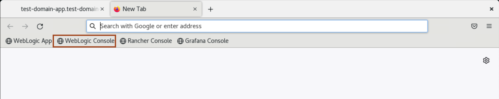

2. Enter the credential and click **Login**.
    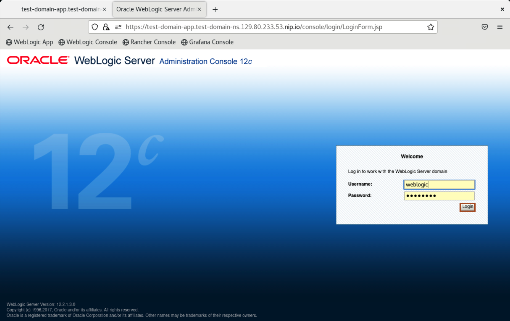

3. Click **Environment** -> **Servers**, to view the running servers inside the domain.
4. Click **Deployments**, to view the deployed **opdemo** application.
5. Click **Services** -> **Data sources**, to view the JDBC datasource for the application.


## Task 4: Scale up/down a WebLogic cluster through WKTUI

1. In Remote Desktop, Open WKTUI. 

2. Click **Component** under **Verrazzano**, and then click **Edit** icon for cluster section as shown below.
    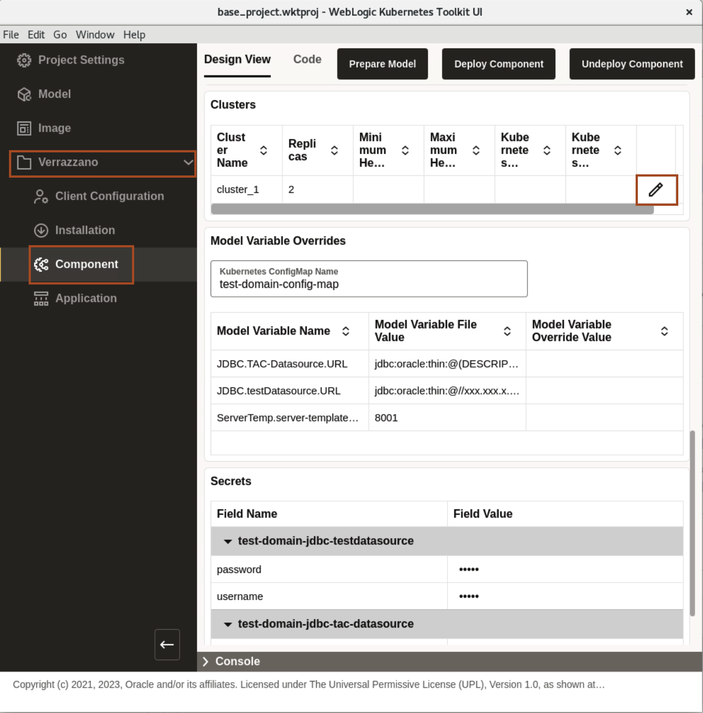
    > Through WKTUI, we create the component "yaml" file for the application. This component file describes the different components of the application whereas a component is a Kubernetes custom resource describing an application's general composition and environment requirement.</br>
     we also create the application "yaml" file for the application. This application yaml file describes runtime features using traits. For example, the ingress trait specifies the ingress host and path, while the metrics trait provides the Prometheus scraper used to obtain the application-related metrics.

3. If you see the **Replicas** value is **2** then change the **Replicas** value from **2** to **3** and click **OK**. This will scale up a WebLogic cluster and if you see the **Replicas** value is **3** then change the **Replicas** value from **3** to **2** and click **OK**.  This will scale down a WebLogic cluster.
    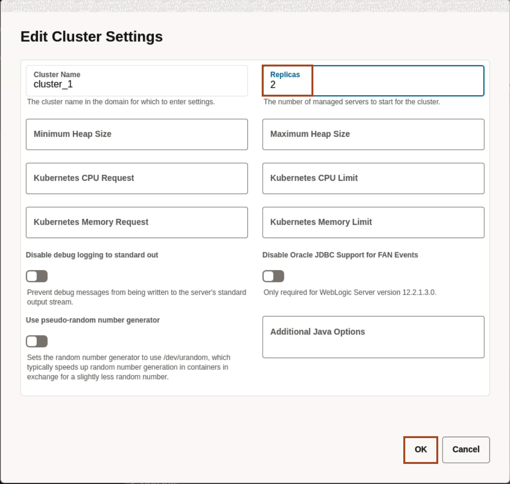

4. Open the terminal, copy and paste the following command to the terminal. 
    ```bash
    <copy>kubectl get pods -n test-domain-ns -w</copy>
    ```
    
    >  Below screenshot shows scale up WebLogic cluster.

5. Click **Deploy Component** to re-deploy the **opdemo** application.

## Task 5: Explore the Rancher and Grafana Console

1. Open a new tab in Chrome browser and Click the third Bookmark **Rancher Console**. Click **Login with Keycloak**. Username and Password are already fill, so click **Sign in**.
    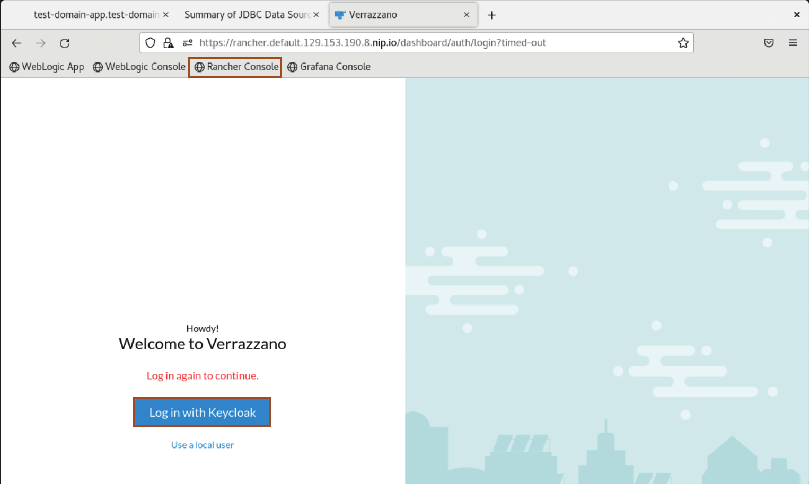
    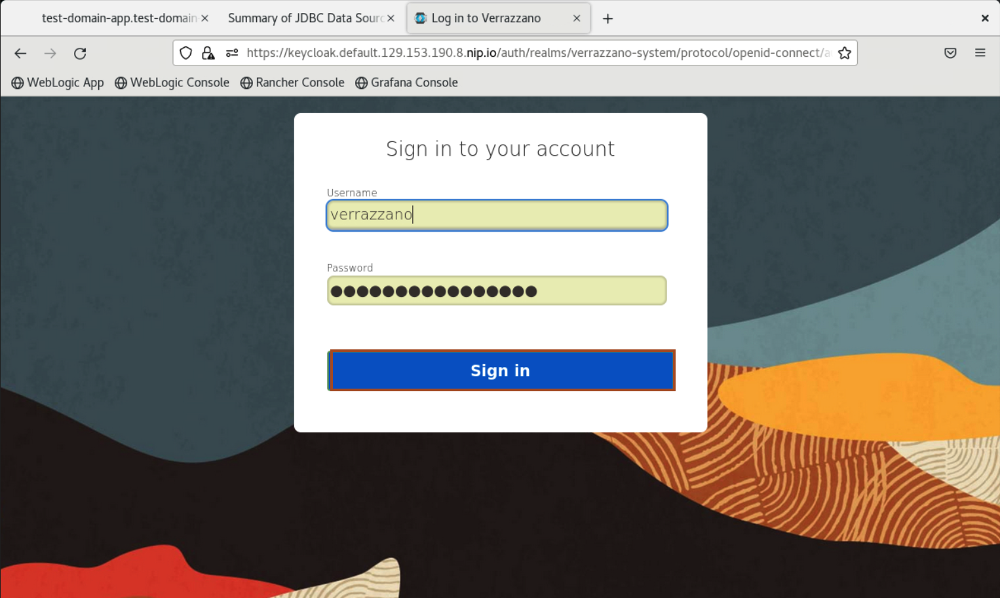

3. From the home page of the rancher console, you can view the Verrazzano Links. you can access any of these consoles from rancher console.Click **Hamburger menu** -> **Verrazzano**.
    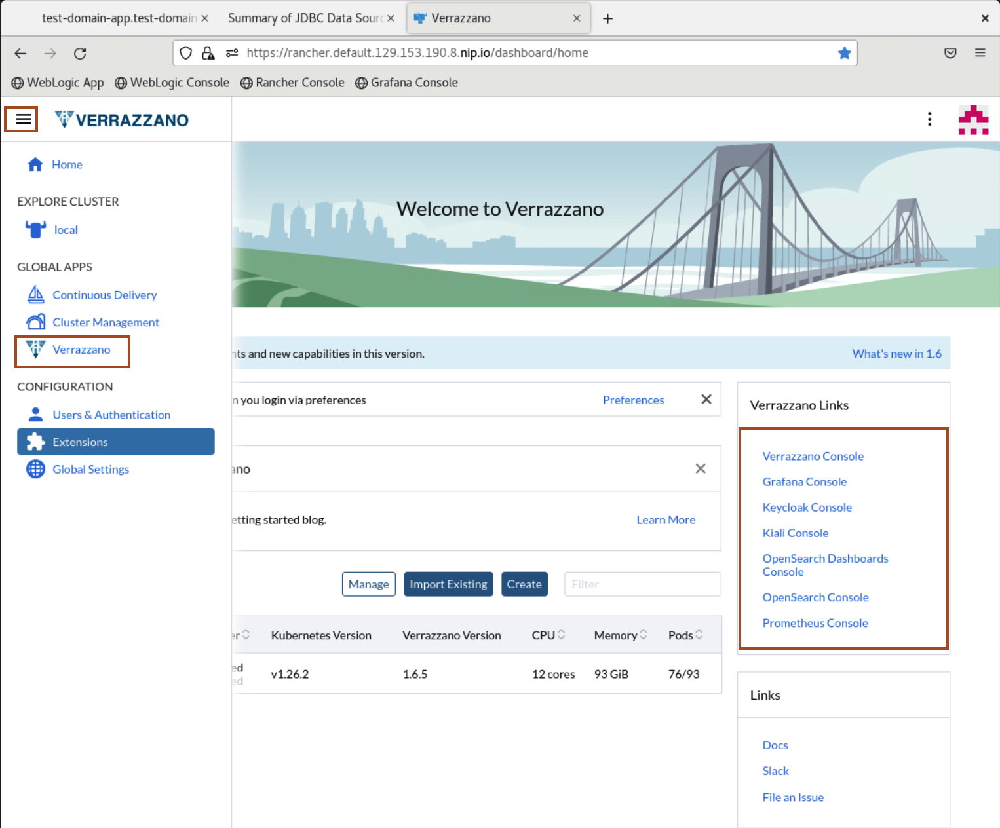


4. Click **Applications**. This section shows all the applications with their namespace and is managed by Verrazzano. Click the **hello-helidon-appconf** application within the **hello-helidon** namespace.
    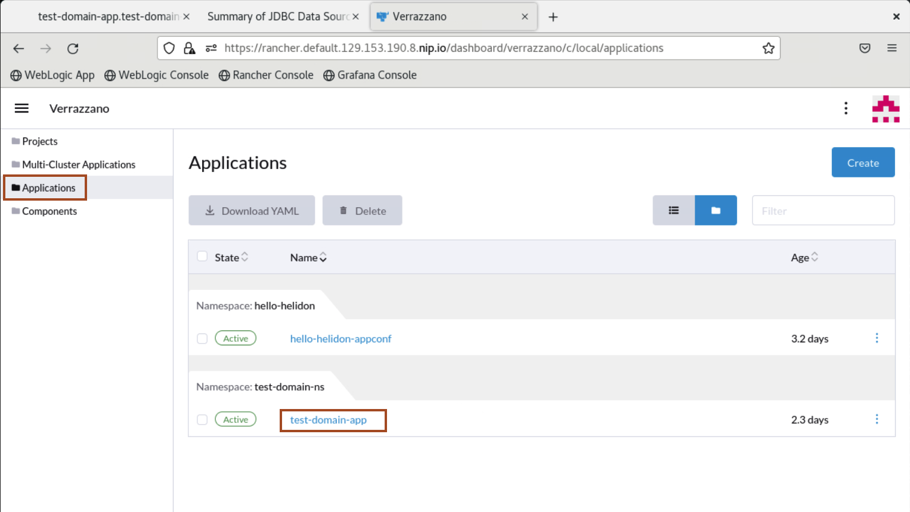


5. You can view the pods associated with the application. The pod name contains an auto-generated unique string to identify that particular replica. To view the Component associated with the application, click **Components**.
    
    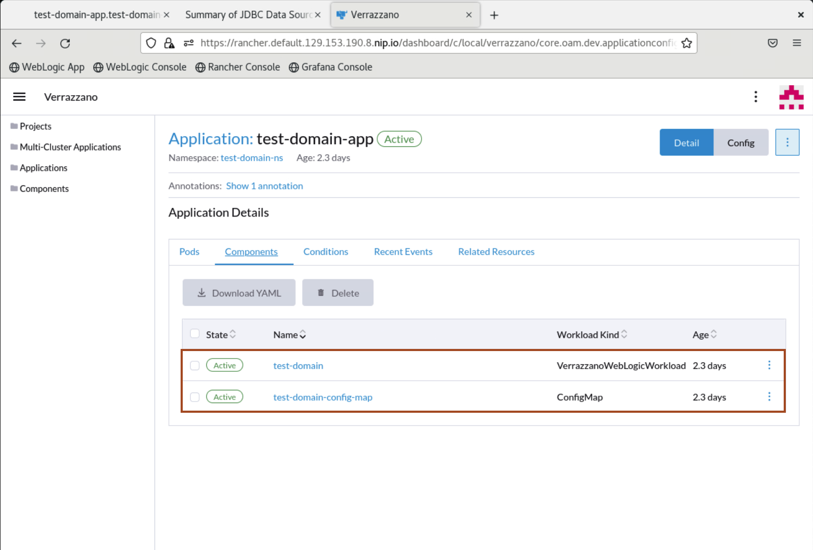


6. Click **Hamburgar menu** -> **local**, to open the **Cluster Explorer**. The **Cluster Explorer** allows you to view and manipulate all of the custom resources and CRDs in a Kubernetes cluster from the Rancher UI.
    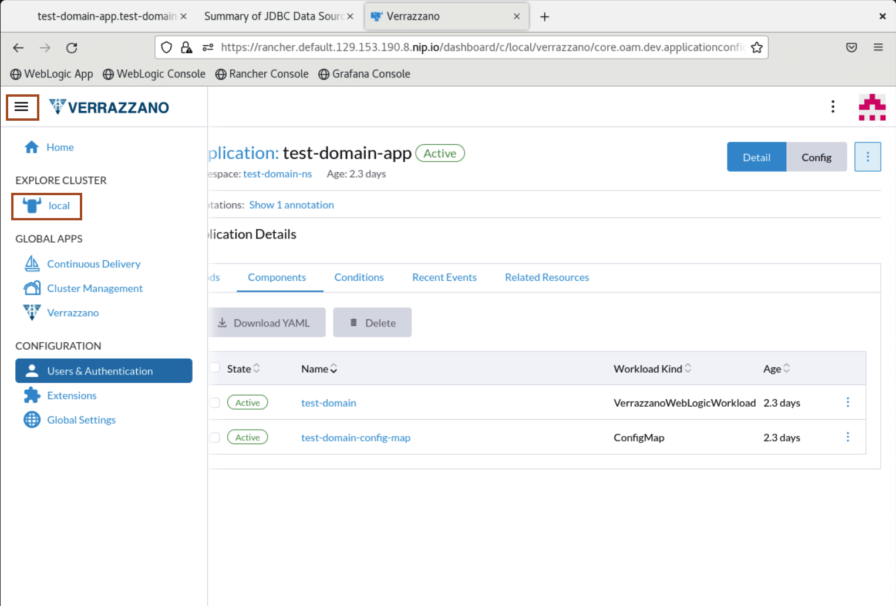
    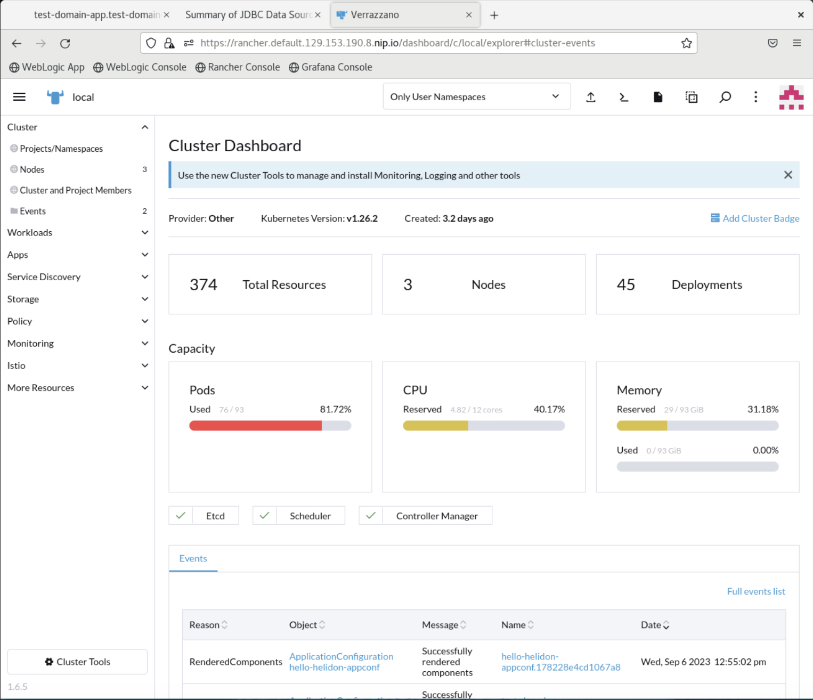


7. Open a new tab in Chrome browser and Click the fourth Bookmark **Grafana Console**.
    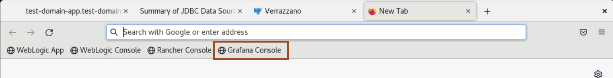


8. The Grafana Home Page opens. Select **Home**  at the top left.

9. Type **WebLogic** and you will see **WebLogic Server Dashboard** under **General**. Select **WebLogic Server Dashboard**.

    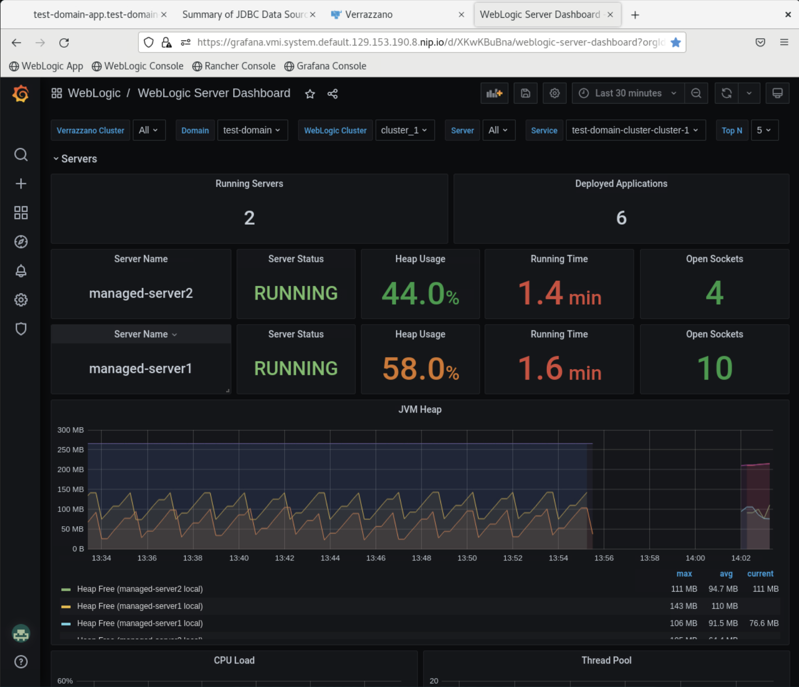

    Here you can observe the two managed servers under **test-domain**. You can view **Heap Usage**, **JVM Heap**, **CPU Load** and other data.


## Task 6: Showcase changes in application, WebLogic Remote Console console and Verrazzano Console

1. Access the application URL, and verify that application is running on managed server 3 as well. 
    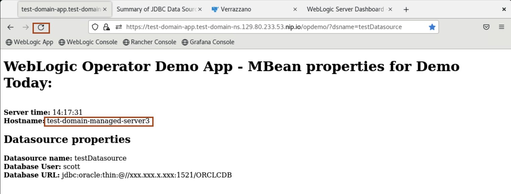


2. Refresh the grafana console, and you can view **managed-server3** here as well.
    

3. Open WebLogic Remote Console, and you can show **managed-server3** updated here as well.
    

## Acknowledgements

* **Author** -  Ankit Pandey
* **Contributors** - Maciej Gruszka, Sid Joshi
* **Last Updated By/Date** - Ankit Pandey, September 2023
